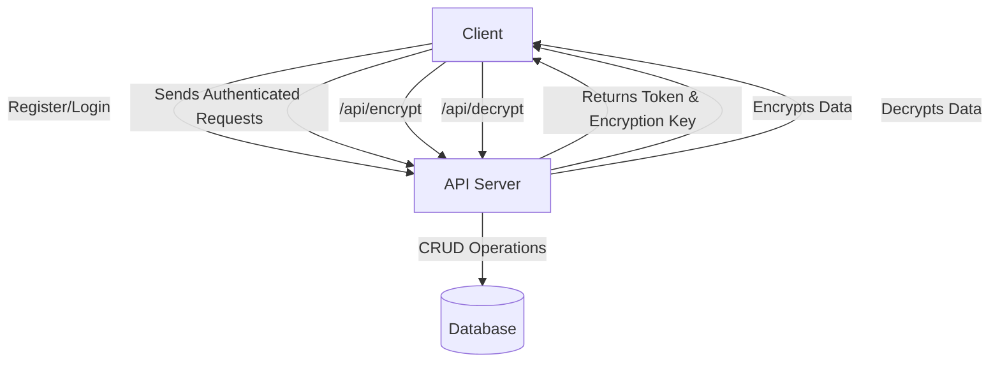

# Secure API with Authentication and Encryption

This project is a Laravel 12 application that provides a secure RESTful API with user authentication, per-user article CRUD, and request/response encryption using Laravel Sanctum.

---

## Features

**1. User Registration & Login**: Register and login endpoints using Laravel Sanctum. On login, users receive an API token and a unique encryption key.
**2. Article CRUD**: Authenticated users can create, read, update, and delete their own articles. Each article is linked to its creator.
**3.User-Specific Data Access**: Users can only access and modify their own articles.
**4. Encryption/Decryption Endpoints**: Endpoints to encrypt and decrypt data using the user's API key. The encryption key is regenerated on each login.
**5. API Protection**: All sensitive routes are protected by Sanctum's auth middleware.
**6. Rate Limiting & Error Handling**: (Optional) Can be added using Laravel's built-in features.

---

## API Endpoints
| Method | Endpoint              | Description                        | Auth Required |
|--------|-----------------------|------------------------------------|--------------|
| POST   | /api/register         | Register a new user                | No           |
| POST   | /api/login            | Login and get API token/key        | No           |
| POST   | /api/articles         | Create an article                  | Yes          |
| GET    | /api/articles         | List all user's articles           | Yes          |
| GET    | /api/article/{id}     | Get a single article by ID         | Yes          |
| PUT    | /api/articles/{id}    | Update an article                  | Yes          |
| DELETE | /api/articles/{id}    | Delete an article                  | Yes          |
| POST   | /api/encrypt          | Encrypt data with user key         | Yes          |
| POST   | /api/decrypt          | Decrypt data with user key         | Yes          |

---

## Data Flow Diagram (DFD)



---

## Entity Relationship Diagram (ERD)

```mermaid
erDiagram
    USER ||--o{ ARTICLE : owns
    USER {
        int id PK
        string name
        string email
        string password
    }
    ARTICLE {
        int id PK
        string title
        text content
        int user_id FK
        timestamps
    }
    }
```

## Setup Instructions

1. **Clone or Download** this repository.
2. **Install dependencies:**
   ```powershell
   cd secure-api-laravel
   composer install
   ```
3. **Copy .env and generate app key:**
   ```powershell
   copy .env.example .env
   php artisan key:generate
   ```
4. **Configure database:**
   - By default, uses SQLite. No changes needed for local dev.
5. **Run migrations:**
   ```powershell
   php artisan migrate:fresh
   ```
6. **Serve the app locally:**
   ```powershell
   php artisan serve
   ```
7. **Test API endpoints** using Postman or curl. Use the token from `/api/login` as a Bearer token for authenticated requests.

---

## Encryption/Decryption Usage
- On login, you receive an `encryption_key`.
- Use `/api/encrypt` to encrypt data before sending to the server.
- Use `/api/decrypt` to decrypt data received from the server.
- The encryption key is unique per login and invalidated on logout or new login.

---

## Notes
- All article endpoints are user-specific and protected.
- For production, use a persistent cache (not array) for encryption keys.
- Extend with rate limiting, resource classes, and error handling as needed.

---

**Author:** Prashant Kumar
